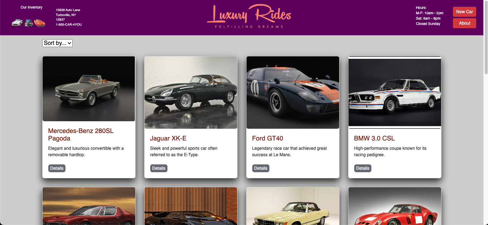
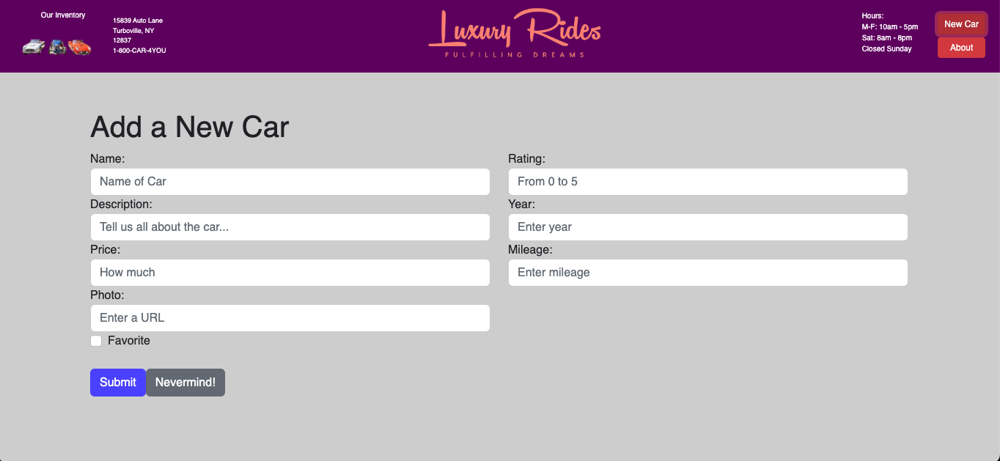

# LuxuryRides App

### *(Install procedure at end of this page)* 

## **About My Project** 

<a href="https://myluxuryrides.netlify.app/" target="_blank">Click here - LuxuryRides App</a>

Introducing "LuxuryRides: The Ultimate Destination for High-End and Collectable Cars"

Welcome to LuxuryRides, the premier platform for enthusiasts and collectors seeking the finest and most sought-after automobiles. Our full-stack application combines cutting-edge technology with a passion for luxury vehicles, providing you with an exceptional user experience. Whether you're a connoisseur, a dreamer, or a discerning buyer, LuxuryRides is your gateway to the world of high-end automotive excellence.

With LuxuryRides, we've curated a meticulously crafted selection of iconic and rare automobiles. From elegant convertibles to powerful sports cars, our collection showcases the most coveted brands and models in the industry. Our team of experts scours the market to bring you a wide range of options, ensuring that you can find the car of your dreams.

The front-end of our application is built on React, offering a seamless and intuitive interface for browsing, exploring, and interacting with our collection. You can easily perform CRUD operations on each vehicle, from viewing detailed information and images to creating new listings and editing existing ones. Our thoughtfully designed forms make it effortless to add and update listings, ensuring that the process is user-friendly and efficient.

On the back-end, our RESTful server powers the entire application, allowing for seamless communication and data management. We've implemented a robust database structure with multiple fields and data types, ensuring the accuracy and integrity of our car listings. You can expect a reliable and secure experience, with routes dedicated to creating, reading, updating, and deleting resources. Additionally, our server provides appropriate responses for unmatched routes, ensuring a smooth browsing experience.

But LuxuryRides is more than just a platform for browsing and buying cars. We've added unique features that go beyond the traditional scope. Our innovative sorting and filtering options enable you to discover vehicles based on specific criteria, making it easier to find your perfect match.

To bring LuxuryRides to life, we've deployed both the front-end and back-end applications to the web. You can access our platform from anywhere, anytime, using the provided URL. Our GitHub repositories house the source code for both applications, ensuring transparency and collaboration. You'll also find comprehensive setup instructions and documentation in the readme files, allowing you to explore and contribute to the project.

Experience the thrill of luxury automotive excellence with LuxuryRides. Start your journey today by visiting our website and discover a world where passion meets craftsmanship. Explore our collection, create your dream car, and immerse yourself in the captivating world of high-end and collectible automobiles. LuxuryRides is here to make your automotive dreams a reality.

  

## App Screenshots

<!--  -->
### The Home Screen

|  |
|-|

### Individual Product Page

|  |
|-|

### New Product Page

|  |
|-|

/Users/markrobertson/Desktop/ProductsAppFolder/frontend/src/assets/NewProductPage.png

  
## 😁 About the developer 😁

  

### Mark Roberston

I'm currently a Full Stack Web Development Fellow at Pursuit, a 12-month, Google-funded software engineering fellowship with a 9% acceptance rate whose graduates have been hired as developers at leading companies such as Pinterest, JP Morgan, Citi, Spotify, and Blackstone. I'm currently learning Express, having already studied React, JavaScript, HTML & CSS and I am training to become a software engineer so that I can solve real-world problems. When I'm not coding, I enjoy movies, watching Formula 1 racing, music, travel and playing with my German Shepherd. Being a Pursuit Fellow will give me the foundation to go on and learn new and exciting languages such as Python, C++, C# et al. that I would like to use both personally and professionally. My first personal project will be to design and implement a quantitative trading algorithm that I can run through an API to a trading platform. I would very much enjoy working for a start-up (as I have start-up experience) or even a large financial firm, as my experience up until Pursuit has been in the financial markets.

<a href="https://github.com/MarkRobertson67" target="_blank">GitHub</a>
<a href="https://www.linkedin.com/in/mark-robertson-ny-uk" target="_blank">LinkedIn</a>
  

<a href="https://trello.com/b/M5mUJwWm/luxuryrides" target="_blank" rel="noopener noreferrer" target="_blank">Trello Board</a>

# **How to install** 

Welcome again to the LuxuryRides App! This guide will walk you through the installation and setup process to get the app up and running on your local machine.

## **Prerequisites**

Before you begin, please ensure that you have the following software installed on your machine:

- Node.js: Install Node.js from the official website: https://nodejs.org
- PostgreSQL: Install PostgreSQL from the official website: https://www.postgresql.org

# **Installation**

## **Back-end**

1.  Clone the repository:   git clone <repository URL>
2.  Navigate to the back-end directory: cd back-end
3.  Install the back-end dependencies:  npm install
4.  Create a .env file in the back-end directory and configure the following environment variables:  
PORT=2525 
PG_HOST=localhost 
PG_PORT=5432 
PG_DATABASE=products 
PG_USER=postgres 
5.  Make sure to include in your .gitignore file:   node_modules
.env
.DS_Store
5.  Start the back-end server:  npm start, which will actually start Front and back-end.

## **Front-end**

1.  Open a new terminal window and navigate to the front-end directory: cd ../front-end
2.  Install the front-end dependencies: npm install
3.  Create a .env file in the front-end directory and configure the following environment variables: REACT_APP_API_URL=http://localhost:2525
4.  Make sure to include in your .gitignore file:   node_modules
.env
.DS_Store
5.  Start the front-end development server: npm start
This will start the front-end server at http://localhost:3000.
6.  Access the app in your web browser: Open your preferred web browser and visit http://localhost:3000 to see the LuxuryRides App in action.

# **Database**

To connect to the database and view the tables:

1.  Open the PostgreSQL command line interface by running the following command:   
        1.  psql -U postgres -f db/schema.sql 
        2.  psql -U postgres -f db/seed.sql   or to run run both 'npm run db:setup'
                db:setup: This script is used to set up the initial state of the database. It executes SQL scripts that define the database schema and potentially populate initial data. The purpose of the db:setup script is to create the necessary tables and configure the database to a predefined state. This script is typically run once during the initial setup or when you want to reset the database to its initial state.
        3.  To start the db, 'npm run db:start' & to shutdown the db, 'npm run db:shutdown'
                db:start: This script is used to start the database server. It ensures that the database server is up and running, allowing your application to establish a connection and interact with the database.
                The db:stop script is used to stop the running instance of the database server. It gracefully shuts down the database server, terminating any active connections and releasing system resources. The purpose of the db:stop script is to ensure a clean and controlled shutdown of the database server. 
                
                Typically, you would use the `db:stop` script when you want to stop the database server after you have finished using it or when you need to perform maintenance tasks. It ensures that the database server is properly shut down, preventing any potential data corruption or inconsistencies.

        4.   To summarize:

                - `db:start` starts the database server, making it available for your application to connect.
                - `db:setup` initializes the database with the necessary structure and initial data.
                - `db:stop` gracefully shuts down the running instance of the database server.

These scripts work together to manage the lifecycle of the database server, from starting it up to setting it up and finally stopping it when it's no longer needed.

2.  Once logged in, you can view the list of tables by running the following command: \dt
3.  To view the contents of a specific table, use the following command:    SELECT * FROM poduct;

That's it! You should now have the LuxuryRides App installed and running on your local machine. Enjoy exploring the world of fast and beautiful cars!